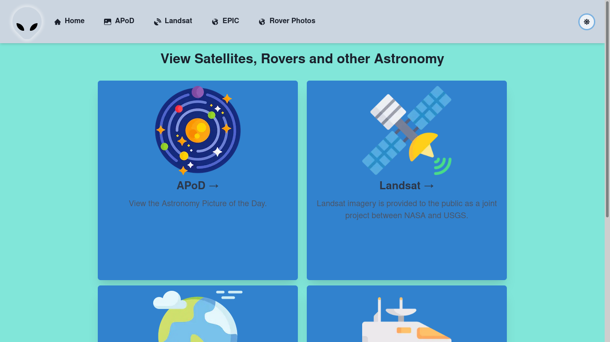
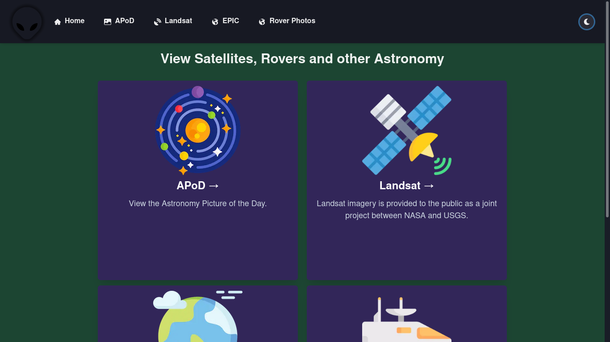
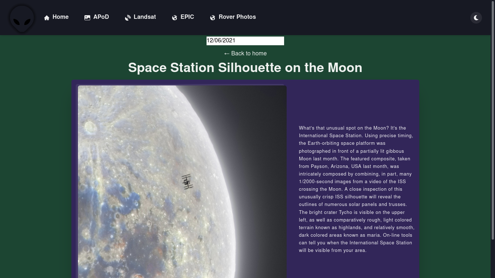

## Resources Used
- [Next.js](https://nextjs.org/)
- [ChakraUI](https://chakra-ui.com/)
- [Framer Motion](https://www.framer.com/motion/)
- [Formik](https://formik.org/)

## Local Usage
Install packages with:

```sh
yarn
```

or 

```sh
npm install
```

**then**

```sh
npm run dev
```

Get free API key from [Nasa APIs](https://api.nasa.gov/) 
Then create .env file in home project directory and provide property `API_KEY="Your_Key"`

Demo can be seen from [Vercel](https://nasa-app-lilac.vercel.app/)

## Screenshots
<table>
  <tr>
    <td>Light Mode</td>
    <td>Dark Mode</td>
    <td>Pic of the Day</td>
  </tr>
  <tr>
    <td valign="top"></td>
    <td valign="top"></td>
    <td valign="top"></td>
  </tr>
 </table>
